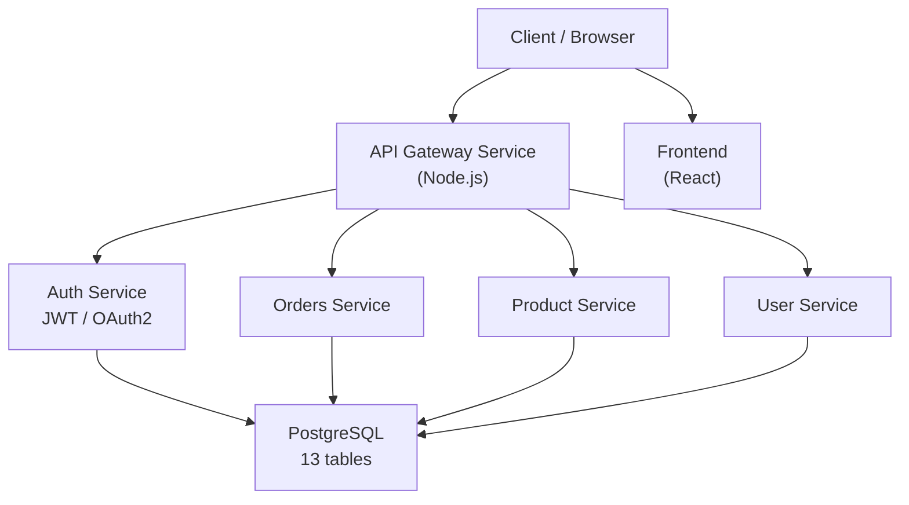
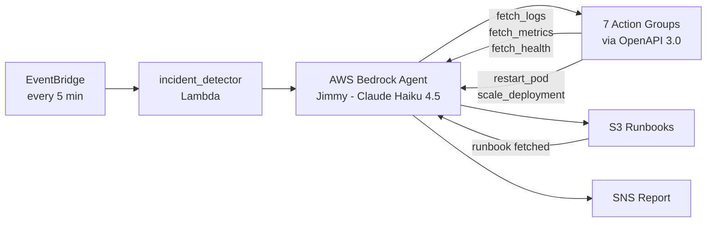

# Jimmy — AI-Powered Microservices Backend Platform with Autonomous Incident Response


> A production-grade backend platform built with Python and Node.js, featuring an autonomous AI agent (Jimmy) for automated incident response, a microservices architecture with 18 REST API endpoints, PostgreSQL database, and cloud-native deployment on AWS EKS.

---

## 🧠 Tech Stack Highlights

| Layer | Technologies |
|---|---|
| **Backend & APIs** | Python, Node.js, REST APIs, OpenAPI 3.0, Streamlit |
| **AI Agent** | AWS Bedrock (Claude Haiku 4.5), boto3, LangChain, Agentic AI Workflows |
| **Database** | PostgreSQL (13 tables), SQL, in-memory caching |
| **Microservices** | 6 independent services (auth, gateway, orders, product, user, frontend) |
| **Cloud (AWS)** | EKS, Lambda, EventBridge, SNS, S3, CloudWatch, ECR, Bedrock |
| **CI/CD & Deployment** | GitHub Actions (matrix CI), Docker, ArgoCD, Terraform, Helm, GitOps |
| **Observability** | Prometheus (15s scrape), Grafana, Fluent Bit, CloudWatch |

---

## 📌 Project Summary

Jimmy is a full-stack backend platform combining:
- A **boutique e-commerce microservices application** with 6 backend services and 18 REST API endpoints
- An **autonomous AI agent** (Jimmy) powered by AWS Bedrock that monitors infrastructure and automatically responds to incidents
- A **Python-based operations dashboard** built with Streamlit for real-time system observability
- Designed to reduce manual log triage time from approximately **20 minutes to under 1 minute**

---

## 💡 Why I Built This

Most DevOps tooling and AI agent demos exist in isolation — either a microservices app with no operational intelligence, or an AI agent with nothing real to operate on. I wanted to build something that connected both ends: a real backend application that generates real operational signals, and an AI agent that reasons about those signals and takes autonomous action.

The engineering challenge that interested me most was the **agentic loop** — designing a system where Jimmy could fetch logs, query metrics, identify the root cause, pull the right runbook from S3, execute the fix (restart a pod, scale a deployment), and report the outcome, all without human intervention. Building the 8 Lambda action groups with OpenAPI 3.0 schemas, wiring them to Bedrock's agent runtime, and making the whole thing trigger reliably via EventBridge was a genuine systems design exercise — not a tutorial project.

The secondary goal was proving I could build and deploy a production-grade microservices backend from scratch: auth, gateway, order management, product catalog, user profiles, and a frontend — all independently containerized, deployed to EKS, and managed via GitOps.

---

## 🏗️ Architecture

### Backend Application Layer



### Jimmy AI Agent Layer



---

## 🗂️ Repository Structure

```
jimmy-ai-backend-platform/
├── projects/
│   ├── boutique-microservices/       # Core backend application
│   │   ├── backend/
│   │   │   └── services/             # 6 microservices (Node.js/TypeScript)
│   │   │       ├── auth/             # JWT auth, register, login, logout
│   │   │       ├── gateway/          # API routing
│   │   │       ├── orders/           # Order processing
│   │   │       ├── order-service/    # Order status management
│   │   │       ├── product-service/  # Product catalog + categories
│   │   │       └── user-service/     # Profile + addresses
│   │   ├── frontend/                 # React frontend
│   │   ├── database/                 # PostgreSQL schema (13 tables)
│   │   ├── prometheus/               # Metrics scrape config (15s interval)
│   │   └── grafana/                  # Dashboard ConfigMaps
│   ├── aiops-assistant/              # Jimmy AI agent
│   │   ├── app.py                    # Streamlit operations dashboard
│   │   ├── lambda/                   # 8 Lambda implementations (Python 3.12)
│   │   │   ├── fetch_logs/
│   │   │   ├── fetch_metrics/
│   │   │   ├── fetch_health/
│   │   │   ├── fetch_runbook/
│   │   │   ├── restart_pod/
│   │   │   ├── scale_deployment/
│   │   │   ├── send_incident_report/
│   │   │   └── incident_detector/
│   │   ├── schemas/                  # OpenAPI 3.0 action group schemas
│   │   ├── runbooks/                 # S3 runbook templates
│   │   ├── setup-iam.sh              # IAM roles setup (run first)
│   │   └── deploy.sh                 # Full agent deployment script
│   └── Infrastructure/               # Terraform IaC
│       └── modules/
│           ├── eks/                  # EKS cluster (1-2 nodes, m7i-flex.large)
│           ├── ecr/                  # 7 ECR repositories
│           ├── vpc/                  # VPC, 3 subnets across AZs
│           └── argocd/               # GitOps setup
├── gitops/
│   └── k8s/                          # Kubernetes manifests (ArgoCD managed)
│       ├── backend/                  # Deployment YAMLs for all services
│       ├── database/                 # PostgreSQL StatefulSet
│       └── frontend/                 # Frontend deployment
└── .github/
    └── workflows/
        └── ci.yml                    # Matrix CI (7 images parallel)
```

---

## 🚀 Getting Started

### Prerequisites

```bash
# Required tools
aws --version          # AWS CLI (credentials configured)
kubectl version        # Kubernetes CLI
terraform --version    # >= 1.0
helm version           # Kubernetes package manager
argocd version         # GitOps CLI
gh --version           # GitHub CLI
docker --version       # Container builds
python3 --version      # >= 3.12 (for Jimmy agent)
```

### 1. Clone the repository

```bash
git clone https://github.com/joeldepuri/jimmy-ai-backend-platform.git
cd jimmy-ai-backend-platform
```

### 2. Provision AWS Infrastructure

```bash
cd projects/Infrastructure

# Initialize and apply Terraform
# This creates: VPC (10.1.0.0/16, 3 subnets), EKS cluster,
# 7 ECR repositories, node group (m7i-flex.large, 1-2 nodes)
terraform init
terraform plan
terraform apply
```

### 3. Configure kubectl for EKS

```bash
aws eks update-kubeconfig \
  --region us-east-1 \
  --name eks-cluster
kubectl get nodes   # should show 1-2 ready nodes
```

### 4. Set up IAM for Jimmy

```bash
cd projects/aiops-assistant

# Creates: aiops-lambda-role, aiops-bedrock-agent-role
chmod +x setup-iam.sh
./setup-iam.sh
```

### 5. Deploy Jimmy (AI Agent + all 8 Lambdas)

```bash
# Deploys all 8 Lambda functions, creates Bedrock Agent,
# sets up 7 action groups, configures EventBridge (every 5 min),
# uploads runbooks to S3, configures SNS
chmod +x deploy.sh
./deploy.sh
```

### 6. Install ArgoCD and deploy application

```bash
# Install ArgoCD
kubectl create namespace argocd
kubectl apply -n argocd \
  -f https://raw.githubusercontent.com/argoproj/argo-cd/stable/manifests/install.yaml

# Apply GitOps manifests — ArgoCD takes over from here
kubectl apply -f gitops/argo-cd.yml
kubectl apply -f gitops/kustomization.yml
```

### 7. Run the Streamlit dashboard

```bash
cd projects/aiops-assistant
pip install -r requirements.txt   # streamlit, boto3, python-dotenv
streamlit run app.py
# Access at http://localhost:8501
```

---

## ⚙️ CI/CD Pipeline

**GitHub Actions Matrix CI** (`.github/workflows/ci.yml`):
- Builds **7 Docker images in parallel** — auth, gateway, orders, order-service, product-service, user-service, frontend
- Tags each image with commit SHA for full deployment traceability
- Pushes to **AWS ECR** (7 repositories)
- **66% faster** than sequential builds via matrix strategy

**GitOps Deployment via ArgoCD:**
- Watches `gitops/k8s/` directory
- Any push to main triggers automatic sync to EKS cluster
- Closed loop — cluster state always matches Git state

---

## 🔍 Observability Stack

| Tool | Purpose | Config |
|---|---|---|
| Prometheus | Metrics collection | 15s scrape interval |
| Grafana | Dashboards | Deployed via ConfigMap |
| Fluent Bit | Log aggregation | DaemonSet → CloudWatch |
| CloudWatch | Log storage + alerts | AWS native |

---

## 🧠 What I Learned

**Agentic AI system design is harder than it looks.** Wiring AWS Bedrock's agent runtime to real Lambda action groups via OpenAPI 3.0 schemas requires very precise schema definitions — any mismatch between what Bedrock expects and what the Lambda returns causes silent failures. Debugging this taught me to think carefully about API contracts as a first-class concern, not an afterthought.

**GitOps is a genuinely different mental model.** I came in thinking ArgoCD was "just another deployment tool." Realizing that the Git repo is the source of truth — not the cluster — and that the cluster reconciles toward Git rather than the other way around, changed how I think about state management in distributed systems.

**Observability must be designed in, not bolted on.** I added Prometheus and Grafana after the initial deployment and had to restructure how services exposed metrics. Doing it from the start would have been significantly easier. This is now a lesson I apply to every new backend service I build.

**Terraform module design matters at scale.** Breaking infrastructure into modules (eks, ecr, vpc, argocd) made the codebase maintainable. A flat Terraform file would have been unmanageable across 3 availability zones and 7 ECR repositories.

---

## 🔗 Related

- **YOLOv5 ML Project**: [github.com/joeldepuri/yolov5-ml-web-platform](https://github.com/joeldepuri/yolov5-ml-web-platform)
- **Author**: Jedeediah Joel Depuri
- **LinkedIn**: [linkedin.com/in/joeldepuri](https://linkedin.com/in/joeldepuri)
- **GitHub**: [github.com/joeldepuri](https://github.com/joeldepuri)
